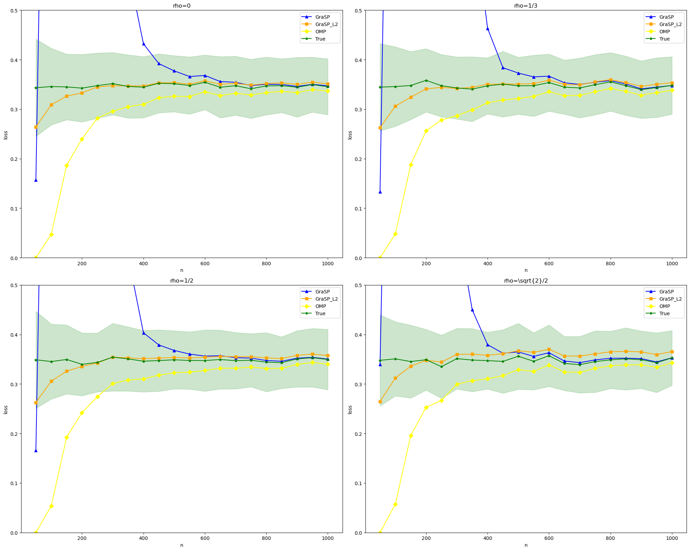
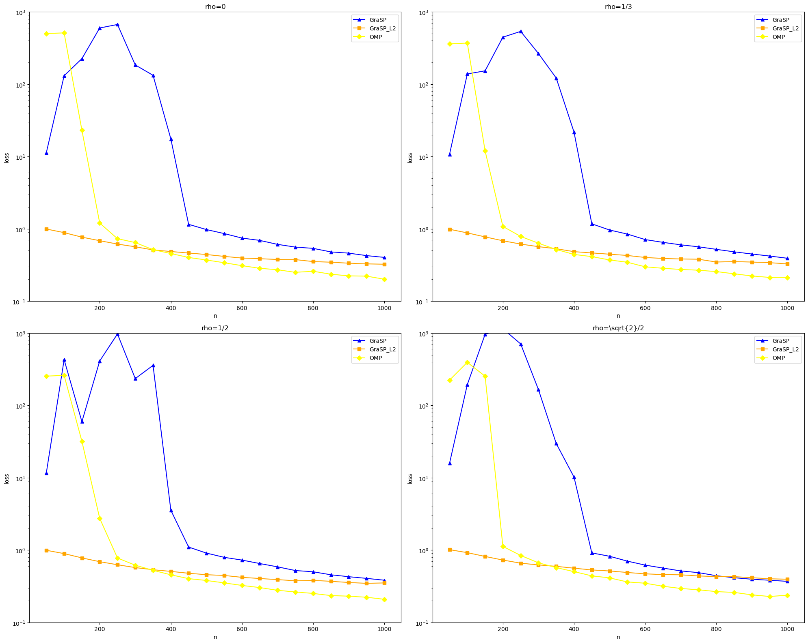
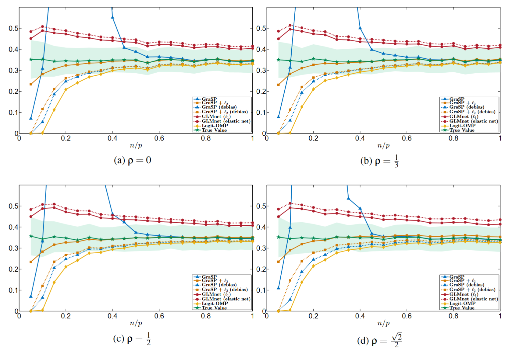
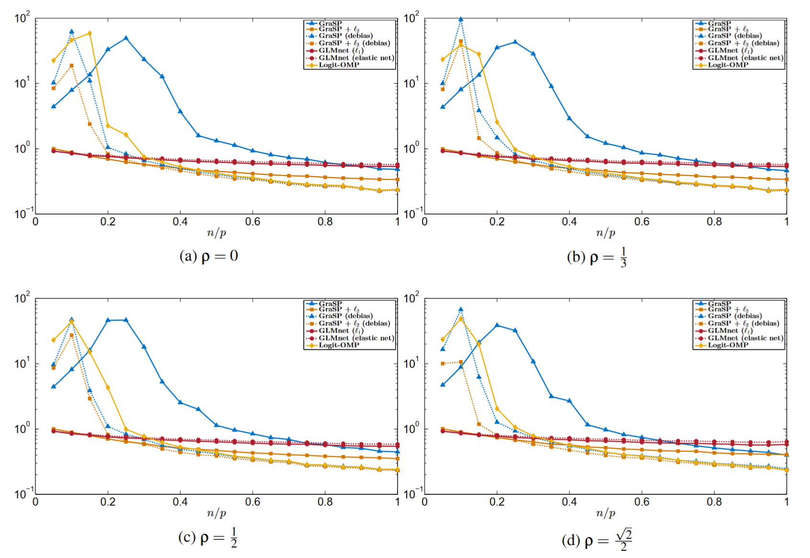
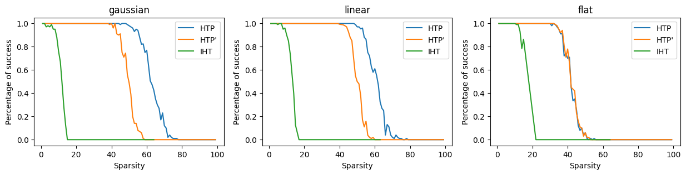
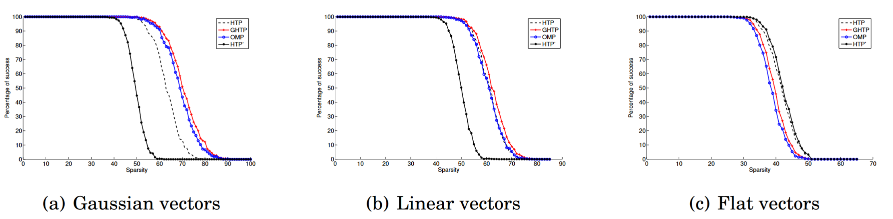
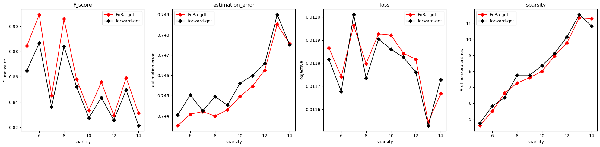
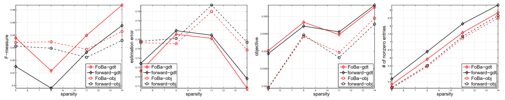

# skscope-reproducibility

Here are some reproducibility code of sparse convex optimization algorithms in library ``skscope``. The name of files in this repository is the corresponding algorithm, and `*.py` files contains the code of reproducibility experiments, `*.csv` files contains results of reproducibility experiments, `*.ipynb` files plot figures of results.

## GraSP

Here we reproduce the result of _Greedy sparsity-constrained optimization_.

This is the figure of reproducing:

This is the figure of the paper:

## HTP and IHT

Here we reproduce the result of _Hard Thresholding Pursuit Algorithms: Number of Iterations_.

This is the figure of reproducing:

This is the figure of the paper:

## Foba and OMP

Here we reproduce the result of _Forward-Backward Greedy Algorithms for General Convex Smooth Functions over A Cardinality Constraint_. In the experiment of this paper, algorithms use information not obtainable in practice to select sparsity level. 
And we get different results here because we use cross validation to select sparsity level.

This is the figure of reproducing:

This is the figure of the paper:

Note that the 'forward-gdt' refers to the OMP algorithm.